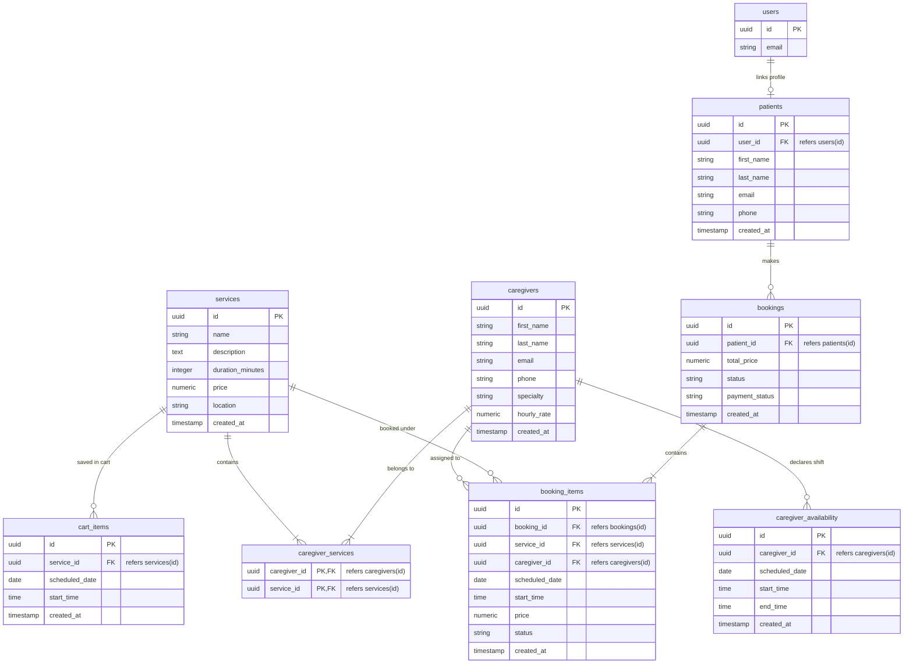

# FamCARE Healthcare System

A modern healthcare management application featuring a Flutter mobile client and a FastAPI local server backed by PostgreSQL/Supabase.

---

## Repository Structure

- `froentend/` — Flutter application for scheduling, booking, and managing healthcare services.
- `healthcare-backend/` — FastAPI REST API handling user synchronization, availability grids, and atomic booking transactions.

---

## 🚀 Getting Started

### 1. Backend Setup (FastAPI)

#### Prerequisites
* Python 3.9 or higher
* PostgreSQL database (e.g. Supabase instance)

#### Setup Steps
1. Navigate to the backend directory:
   ```bash
   cd healthcare-backend
   ```
2. Create and activate a Python virtual environment:
   ```bash
   python3 -m venv venv
   source venv/bin/activate
   ```
3. Install dependencies:
   ```bash
   pip install -r requirements.txt
   ```
4. Create a `.env` file in the `healthcare-backend/` root directory (refer to `.env.example`):
   ```ini
   DATABASE_URL=postgresql://<user>:<password>@<host>:<port>/<dbname>
   SUPABASE_URL=https://<your-project>.supabase.co
   SUPABASE_KEY=<your-service-role-key>
   ```
5. Launch the FastAPI server:
   ```bash
   uvicorn main:app --reload --host 0.0.0.0 --port 8000
   ```
6. (Optional) Populate database with initial mock services, caregivers, and shifts:
   ```bash
   python test_setup.py
   ```

---

### 2. Frontend Setup (Flutter)

#### Prerequisites
* Flutter SDK (Stable channel)
* Android Studio / Xcode (for running on emulators/devices)

#### Setup Steps
1. Navigate to the frontend directory:
   ```bash
   cd froentend
   ```
2. Fetch package dependencies:
   ```bash
   flutter pub get
   ```
3. Configure the backend API endpoint in [api_config.dart](file:///Users/swastik/Projects/health_care/froentend/lib/auth/api_config.dart):
   ```dart
   class ApiConfig {
     static const String baseUrl = 'http://localhost:8000'; // Or your machine's LAN IP
   }
   ```
4. Launch the application:
   ```bash
   flutter run
   ```

---

## 🗄️ Database Schema

The system connects directly to a PostgreSQL database. Below are the key tables and relationships:



### Table Definitions

1. **`patients`**
   * Links a registered person to their Supabase user ID (`user_id` referencing `auth.users`).
   * Supports local profile auto-seeding if no profile is active.

2. **`services`**
   * Lists available healthcare offerings (e.g. Physiotherapy Session, Wound Care) including pricing and clinic rooms.

3. **`caregivers`**
   * Stores healthcare professionals, specialties, and hourly rates.

4. **`caregiver_services`**
   * Association pool table mapping which caregivers are certified to perform which services.

5. **`caregiver_availability`**
   * Defines caregiver shifts (e.g., `08:00` to `18:00`) for specific calendar dates.
   * If no explicit shifts are configured in this table, the backend falls back to a default `08:00 - 20:00` schedule.

6. **`bookings` & `booking_items`**
   * Transactions representing finalized bookings, referencing patient orders, caregivers assigned, and appointment times.
